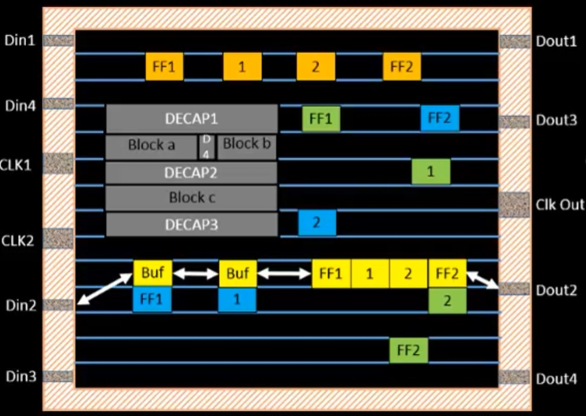

# <p align="center"> Advanced Physical Design Workshop on OpenLANE using Skywater 130nm PDK </p>

# <p align="center"> Introduction </p>
ASIC design is an involved process. In the distant past (few decades ago), ASIC designers were people who designed powerful processors (think Intel 8080 microprocessor) using "[rubylith](https://en.wikipedia.org/wiki/Rubylith), light boards, rulers, electric erasers, and a [digitizer](https://en.wikipedia.org/wiki/Digitization)" [[1]](https://en.wikipedia.org/wiki/Intel_8086). Soon people began realizing how useful these tiny things called processors were in making their lives better and within a year (1974), MITS released their legendary [Altair 8800](https://en.wikipedia.org/wiki/Altair_8800) microcomputer. And, thus, the fascinating story of how humanity's search to automatically add decimal numbers (in 1812 by Charle's Babbage) [3] took a much-needed turn into the right direction, which was to make that technology available to everyday people. This led people to start thinking of new ways to design these pretty tiny but huge pieces of silicon. And that is everyone was rushing to design Electronic Design Automation (EDA) tools and make money out of them. Quickly, within a span of few years, companies started designing tools to design Very Large Integrated Circuits (VLIC) very quickly. And, thus, the very end of 1900s started the very beginning of new technological era, an era that would create the most technological acceleration than what humans had achieved throughout their entire existence. Somewhere in this acceleration, companies that specialized in these EDA tools and chip fabrication were becoming giants providing services to other companies, yet still out of reach of the everyday people. In few decades of their existence, these companies had created proprietary technologies that allowed them to share the whole IC design and fabrication market share between themselves (huge investments lead to huge gains). Then came the open-source revolution for software and hardware. In this open-source revolution, people started contributing to projects that are available in public (including the source and designs) so that everybody could collectively work on it and further the given project (think Linux). Then came the [OpenROAD project](https://openroad.readthedocs.io/en/latest/) in 2018 and with the release of the [Skywater 130nm PDK](https://github.com/google/skywater-pdk), the momentum of open-source IC design is gradually shifting towards the everyday people and that is why we are here, to get started in the path to learning these open-source EDA tools and PDKs.

# <p align="center"> Table of Contents </p>
| Day | Module |Part|                          Topic                                       | Status  |
|:---|:------|:------|:--------------------------------------------------------------------|:-------:|
| 1   |        |       |[Inception of open-source EDA, OpenLANE, and Sky130 PDK]()           |:pushpin:|
|     | SK1    |       |[Introduction to RISC-V, QFN-48, Physical chip layout]()             |         |
|     | SK2    |       |[Simplified and detailed RTL2GDS flow using OpenLANE]()              |         |
|     | SK3    |       |[Using OpenLANE for synthesizing sample Pico-RISC-V module]()        |         |
| 2   |        |       |[Good floorplan vs bad floorplan and introduction to library cells](https://github.com/rajivbishwokarma/openlane_rtl2gds_sky130#day-2-good-floorplan-vs-bad-floorplan-and-introduction-to-library-cells)        |   :construction:      |
|     | SK1    |       | [Chip floor planning considerations](https://github.com/rajivbishwokarma/openlane_rtl2gds_sky130#sk1-power-planning-and-floor-planning)        |    :100:     |
|     |        |  L1   | [Utilization Factor and Aspect Ratio](https://github.com/rajivbishwokarma/openlane_rtl2gds_sky130#-utilization-factor-and-aspect-ratio) |   :100: |
|     |        |  L2   | [Pre-placed cells](https://github.com/rajivbishwokarma/openlane_rtl2gds_sky130#-pre-placed-cells) |  :100:  |
|     |        |  L3   | [Decoupling capacitors](https://github.com/rajivbishwokarma/openlane_rtl2gds_sky130#-decoupling-capacitors) | :100:   |
|     |        |  L4   | [Power Planning](https://github.com/rajivbishwokarma/openlane_rtl2gds_sky130#-power-planning) | :100:   |
|     |        |  L5   | [Pin placement and logic cell placement blockage](https://github.com/rajivbishwokarma/openlane_rtl2gds_sky130#) |   :100: |
|     |        |L6-LAB | [Steps to run floorplan using OpenLANE](https://github.com/rajivbishwokarma/openlane_rtl2gds_sky130#) |  :100:  |
|     |        |L7-LAB | [Review floorplan files and steps to view floorplan](https://github.com/rajivbishwokarma/openlane_rtl2gds_sky130#) | :100:   |
|     |        |L8-LAB | [Review floorplan layout in Magic](https://github.com/rajivbishwokarma/openlane_rtl2gds_sky130#) |  :100:  |
|     | SK2    |       | [Library Binding and Placement](https://github.com/rajivbishwokarma/openlane_rtl2gds_sky130#sk2-library-binding-and-placement)        |    :100:     |
|     |        |  L1   | [Netlist binding and initial place design](https://github.com/rajivbishwokarma/openlane_rtl2gds_sky130#) |  :100:       |
|     |        |  L2   | [Optimize placement using estimated wire-length and capacitance](https://github.com/rajivbishwokarma/openlane_rtl2gds_sky130#) |   :100:      |
|     |        |  L3   | [Final placement optimization](https://github.com/rajivbishwokarma/openlane_rtl2gds_sky130#) |  :100:       |
|     |        |  L4   | [Need for libraries and characterization](https://github.com/rajivbishwokarma/openlane_rtl2gds_sky130#) |  :100:       |
|     |        |L5-LAB | [Congestion aware placement using RePlAce](https://github.com/rajivbishwokarma/openlane_rtl2gds_sky130#) |  :100:       |
|     | SK3    |       | [Cell design and characterization flows](https://github.com/rajivbishwokarma/openlane_rtl2gds_sky130#)        |   :100:     |
|     |        |  L1   | [Inputs for cell design flow](https://github.com/rajivbishwokarma/openlane_rtl2gds_sky130#) |  :100:       |
|     |        |  L2   | [Circuit design step](https://github.com/rajivbishwokarma/openlane_rtl2gds_sky130#) |   :100:      |
|     |        |  L3   | [Layout design step](https://github.com/rajivbishwokarma/openlane_rtl2gds_sky130#) |  :100:      |
|     |        |  L4   | [Typical characterization flow](https://github.com/rajivbishwokarma/openlane_rtl2gds_sky130#) |  :100:       |
|     | SK4    |       | [General timing characterization parameters](https://github.com/rajivbishwokarma/openlane_rtl2gds_sky130#)        |      |
|     |        |  L1   | [Timing threshold definition](https://github.com/rajivbishwokarma/openlane_rtl2gds_sky130#) |        |
|     |        |  L2   | [Propagation delay and transition time](https://github.com/rajivbishwokarma/openlane_rtl2gds_sky130#) |       |
| 3   |        |       | [Design library cell using Magic Layout and ngspice characterization]() | :pushpin:  |
| 4   |        |       | [Pre-layout timing analysis and importance of good clock tree]()      | :pushpin: |
| 5   |        |       | [Final steps for RTL2GDS using tritonRoute and openSTA]()             | :pushpin: |

# <p align="center"> Day 2: Good floorplan vs bad floorplan and introduction to library cells </p>
##  **SK1: Power planning and floor planning**
This section covers multiple topics ranging from utilization factor, aspect ratio, pre-placed cells and de-coupling capacitors to power planning and floor planning.

### **[L1] Utilization factor and aspect ratio**

__Utilization factor refers to how much of the total area of the core are you using to place your logic.__ Using the following figure, for example, if a core has an area of 4 * 2 sq. unit and your logic uses four standard cells, each of area 1 sq. unit, which totals to 4 * 1 sq. unit = 4 sq. unit then your utilization factor can be calculated with the following formula.

<p align="center">

</p>

$$ Utilization\ Factor = \frac{Area\ occupied\ by\ the\ netlist}{Total\ area\ of\ the\ core} $$

For the above given data, 
```
Utilization factor = (4 * 1 sq. unit) / ( 4 * 2 sq. unit) = 0.5
```

**Aspect ratio is the ratio between height to width of your logic area.** Using the data from above example, you can calculate the aspect ratio using the following formula.

$$ Aspect\ Ratio = \frac{Height}{Width} $$

For the example above, 
```
Aspect ratio = 2 unit / 4 unit = 0.5
```

Therefore, utilization factor basically measure how much physical space in the core your logic blocks have used and how much space is remaining for your routing and logic cells. Aspect ratio, on the other hand tells you the shape of your core. 

### **[L2] Pre-placed cells**
These are the modules that are in the top level design and reused multiple times, however, instead of instantiating them in multiple locations they are place in in one location and then connections are routed to and from wherever they are needed. Their location is fixed during the whole design cycle and the automatic placement tool will not move them, rather the automatic placement tool will place other modules by condering these modules. 


### **[L3] Decoupling capacitors**
When the physical distance between the power source and a certain pre-placed cells is high, some power will be lost due to the resistance of the wires. Therefore, we need to surround the pre-placed cells with decoupling capacitors. We do this to make sure that when the output switches from logic zero to logic one, the high output is within noise margin (as shown in left figure below). The capacitors are placed as shown in right figure below.

<p float="left">
    
    
</p>

### **[L4] Power Planning**
Voltage droop can occur during a simultaneous low to high transition (or ground bounce during high to low) in, say, a 32-bit bus when the physical distance between the power source and power target components is high. It is not feasible to place decoupling capacitors everywhere to resolve this issue as we won't have enough area to implement our own logic. Therefore, the most efficient method of solving this problem is to create a grid of power sources that span the whole core area, and, thus, provide enough power to all the components. This grid can be seen in the following image.

<p align="center">
    
</p>

In the above image, each pair of VDD and VSS wire is one source and they are routed so that they cover the entire area of the chip.

### **[L5] Pin placement and logical cell placement blockage**
Pinn placement refers to the arrangement of the input and output pins of the design in the most efficient way possible within the mmodule For example, an equivalent pin placement (right) of a logic circuit (left) is given below.

<p float="left">
    
    
</p>

As can be seen from both the images, the inputs and outputs will be placed somwhere close to the module that it belongs to. However, if there any any pre-placed cells in the design, then pre-placed cells' area will be avoided during both the placement of the logic module and routing of the logic module. On interesting point about the pin placement above is the *Clk Out* signal, which is far from *Block b*; this choice of design is made to reduce the number of decoupling capacitors in the module. The fact that simply placing buffers to resolve any irregularities in the signal propagation overcomes the placement of any unnecessary capacitive circuit behavior. Also, it must be noted that the clock ports are wider than other signal ports, this is done because it is necessary to reduce the resitance to the clock as much as possible as everything depends on the clock. Then, finally, this area is blocked to make sure that no logical cells are placed in this part of the core. After the area is blocked, this floorplan is ready for placement and routing. 


### **[L6] Steps to run floorplan using OpenLANE**
<p align="center">

```
[Quick Review] In the last lab, we completed the design preparation step and design synthesis step. We used the following commands to do so.

1. We started out docker environment with: docker
2. We started OpenLANE flow with: ./flow.tcl -interactive
3. We initialized our environment with: package require openlane 0.9
4. We prepared out design with: prep -design picorv32a
5. We synthesized the design with: run_synthesis
```
</p>

In today's lab, we are going to run the steps to do floorplanning in OpenLANE. To do that, we will continue after we ran the synthesis for the **picorv32a** module.

The command to run the floorplanning is simple, just like the syntheis, and you can run this step using the following statement.
```
run_floorplan
```
However, before we do that, it is necessary to understand the different switches that are passed to this command that will change the behavior of the underlying scripts. All of these switches can be studied [**here**](https://openlane.readthedocs.io/en/latest/reference/configuration.html#floorplanning). As mentioned [**here**](https://openlane.readthedocs.io/en/latest/usage/hardening_macros.html#floorplan), it is possible to run the floorplanning in one of the three ways, which can be differentiated based on automatic or manual selection of area. 

These switches can be modified in the files located in the **configuration** folder within openlane directory as shown in the [**OpenLANE configuration directory**](https://github.com/The-OpenROAD-Project/OpenLane/tree/master/configuration) and in the image below.
<p align="center">
    
</p>

### **[L7] Review floorplan files and steps to view floorplan**

The switches for the step can be set in one of the three files and the precedence is set according to the order below.
1. Technology configuration file ([sky130A_sky130_fd_sc_hd_config.tcl](https://github.com/The-OpenROAD-Project/actions-test/blob/main/sky130A_sky130_fd_sc_hd_config.tcl))
2. Design configuration file ([config.json](https://github.com/The-OpenROAD-Project/OpenLane/blob/master/designs/picorv32a/config.json))  [*note: the new version of the OpenLANE flow uses **config.json** whereas the older version used [config.tcl](https://github.com/The-OpenROAD-Project/actions-test/blob/main/config.tcl)*]
3. OpenLANE default configuration file ([floorplan.tcl](https://github.com/The-OpenROAD-Project/OpenLane/blob/master/configuration/floorplan.tcl))

*[NOTE: the files shown in the links are just examples, to actually set the value you will have to change the parameters in the current design directory of **your** project]*

For the current run, we are setting the values to the default as they are in those files. Running the command, we get the following output (left). It will shortly end and should end with a successful message (right) 
<p float="left">
    
    
</p>

### **[L8] Review floorplan layout in Magic**
After the above step, the floorplanning is completed and it can be opened with **magic** to see the result and analyze the effect of the parameters that were set in the initial configuration files.
```
Command syntax: magic -T <path-to-sky130A.tech> lef read <path-to-merged.lef> def read <path-to-picorv32.floorplan.def>

Command: magic -T ~/Desktop/work/tools/openlane_working_dir/pdks/sky130A/libs.tech/magic/sky130A.tech lef read ../../tmp/merged.lef def read picorv32a.floorplan.def &
```


This will open up magic with the result of the floorplan as shown below (left). We can play around with the view to see the pad placement and the cells placed in the design (right).

<p align="center">
    
    
</p>

With this, we are done with the floorplanning step.

---


## **SK2: Library Binding and Placement**
### **[L1] Netlist binding and initial place design**
Before a placement of the logical blocks in the physical core can be done, each components in the design module needs to have an equivalent standard cell. The process of assigning each logial block (think NOT, AND, OR, ...) an equivalent physical standard cell (from the given technology, Sky130, for example) is called netlist binding. These equivalent standard cells are then placed in the core so that each design is as close to other connected module and input/output pads. In the following images, this process can be visually inspected from the initial netlist (1) to the final placement (4). 

<p align="center">
    
</p>

### **[L2] Optimize placement using estimated wire-length and capacitance**
If you noticed, we did not place all the logic blocks in the core in [SK2-L1] i.e., last two blocks from the netlist. This is because we need to optimize how these modules are placed in the core to properly maintain the signal integrity between the sender and receiver blocks. The issue of signal integrity comes into play becasue of the distance between two connecting modules. In case of the third module (green), there is a pre-placed cell between the input and ouptut, and therefore, we have to adjust the placement accordingly. In case of the second module (yellow), there is still significant distance between the input (Din2) and the first receiver (FF1), and with such kind of distance, we cannot gurantee the maintainence of the signal. Therefore, we estimate the wire length and capacitance of the wire and place buffers (as repeaters) between these two components so as to keep the signals intact. This can be seen in the figure below. However, adding additional logic of course increases the delay of the signal. How does this delay affect the overall timing? We will see this in a later timing analysis.

<p align="center">
    
</p>

### **[L3] Final placement optimization**
Now, the routing of modules 3 and 4 (blue and green blocks) present another set of obstacles in the physical design of this module. You can see from the image above that we had to place each components of the same module fairly separate from each other. We have done this so that we can properly route all the modules. In the images below, we can see how both the third (left) and fourh (right) modules are routed using buffers (or routers) in between the logic blocks. Again, this is done by estimating the wire length and chapacitance of the wire when the distance is too large. This estimation is done using slew (or transition) analysis.

:interrobang: [Question] Why did we not follow the same routing principle that we followed for the second module (yellow) [[abutment](https://www.synopsys.com/glossary/what-is-custom-ic.html)]. We could have placed all the logic components for modules 3 and 4 together and then placed buffers all the way from the input to the first flip-flop. The number of buffers in both cases should be the same.

<p align="left">
    
    
</ p>

### **[L4] Need for libraries and characterization**
Everything in the real world is analog and we are using digital design to create analog components. Along the way, we need analog models of the components that we are designing so that we know they will function in the real world. That is, we need analog power and speed characteristics of all the gates (NOT, NAND, NOR, ..) and logic modules (memories) we are using and this is standard cell and library characterization [[Source](https://www.synopsys.com/glossary/what-is-library-characterization.html)]. And, this is a must for any efficient design flow.


### **[L5] Congestion aware placement using RePlAce**
:triangular_flag_on_post: [Note: as of January 26, 2023 the [RePlAce repo](https://github.com/The-OpenROAD-Project/RePlAce) has been archieved in November 8, 2022].

Now we will carry out the physical placement of the standard cells using the RePlAce (Advancing Solution Quality and Routability Validation in Global Placement) tool in OpenLANE. In OpenLANE, placement occurs in two stages: global and detailed. Global placement is a coarse (approximate) placement and the detailed placement is a legal (abutment and no overlap) way of placing for the timing. We can run the placement using the following command. 

```
run_placement
```

When we do this, the placement process starts and this can be seen in the following screenshots of the output window.
<p align="left">
    
    
</p>

We can go ahead and view this implemented placement using **magic**. To do this, we use a similar command to that of the floorplanning. The implemented design is available under **placement** directory inside the **result** folder. Therefore, **cd** into the **placement** folder and run the following command. If you notice carefully, this time we are using **picorv32a.placement.def** instead of the *picorv32a.floorplan.def* file that we previously used.

```
Command: magic -T ~/Desktop/work/tools/openlane_working_dir/pdks/sky130A/libs.tech/magic/sky130A.tech lef read ../../tmp/merged.lef def read picorv32a.placement.def &
```


Zooming into one of the regions, we see that the standard cells are placed and arranged properly in the slots. 

<p align="left">
    
    
</p>

This concludes the placement step in OpenLANE flow.

## **SK3: Cell design and characterization flows**
A cell design flow consists three main steps:
+ Inputs
+ Design Steps
+ Outputs


### **[L1] Inputs for cell design flow**
A typical standard cell for, say, an inverter has to go through a cell design flow before it can be used to design an IC. This design flow consists of using analog characteristic analysis of the cell using SPICE simulation, DRC, and LVS. Every single standard cell in a library, which can contain multiple variation of the same standard cell with different drive strength and/or different size, has to go through this process. The parameters that are used for the simulation are provided by the foundries and a collection of all these components used to create standard cells is called a **Process Design Kit (PDK)**.

Specifically, inputs for a cell design flow can be listed as: 
* Process Design Kits (PDKs):
  * Design Rule Check (DRC)
  * Layout vs Simulation (LVS)
  * SPICE models
  * Library 
  * User-defined specs
    * Cell height
    * Supply voltage
    * Metal layer placements
    * Drawn gate-length

### **[L2] Circuit design step**
Design involves the use of the cells obtained as the inputs. The circuit design step involves the designing of the circuit using nMOS, pMOS transistors so that they meet the minimum requirements asked by the foundries. Function implementation, transistor sizing, saturation characterization and voltage calculation are some of the steps of circuit design. The output of this step is called Circuit Description Language (CDL).

### **[L3] Layout design step**
From the implemented circuit, pMOS network graph and nMOS network graph are extracted and the Euler's path is obtained. Now, Euler's path is used to design the stick diagram, which is a literal representation of the physical layout that will be laid out as the result of all of this flow. This stick diagram must adhere to the design rules given by the foundry. The output of this step will be the following. 
* GDSII: It contains the layout file
* LEF: It defines the width and height of the cell
* Extracted SPICE netlist (.cir): It contains all the parasitics i.e., resistance and mainly capacitances of all the elements in the circuit.

### **[L4] Typical characterization flow**
Following steps can be typically followed to carry out a characterization flow. 
1. Read the NMOS and PMOS models provided by the foundry. 
2. Read the extracted SPICE netlist
3. Define and recognize the behavior of the cell
4. Read the sub-circuit of the required module
5. Attach the necessary power sources. 
6. Apply the stimulus to the module. 
7. Provide the necessary output capacitance (by varying in a range).
8. Provide the necessary simulation commands (**.tran** for transient simulation, **.dc** for DC simulation)
9. Feed all the data from step 1 to step 8 as a configuration file to [GUNA](https://www.paripath.com/Products/Guna).

The characterization is the extraction of timing, power, and parasitics information of the given design. The output from this steps are given below. The outputs are **.lib** files with following information.
* Timing data
* Noise data
* Power data
* Function data

## **SK4: General timing characterization parameters**

### **L1 Timing threshold definition**

The following variables are used in GUNA to do timing characterization. The cuve column represents the color of the plot shown in the following graph. The graph is associated with a buffer (two inverts placed in a cascade) and for the first plot the blue waveform is the input to the second inverter while the red waveform is the output from the buffer (or output from the second inverter). For the middle plot, the red waveform is the input stimulus to the first inverter and the blue waveform is the output from the first inverter (see how similar two output waveforms in both plots are). The last plot also represents the input and output for the first ineverter, the only difference is that the stimulus is transitioning from high to low in this case.

<p align="center">
    
    
    
</p>

<p >
<table align="center">
<tr><th> <p align="center"> Output Waveform </p></th><th> <p align="center">  Input Waveform </p></th></tr>
<tr><td>

|Timing threshold variables| Curve (Plot-1) | Definition|
|:--------------------| :----|:-----|
|    slew_low_rise_thr  | Red| Slew rate (solpe) near to zero (typically 20% to 30% of low power supply) |
|    slew_high_rise_thr | Red | Slew rate near to high voltage (typically 20% of high power supply)  |
|    slew_low_fall_thr  | Blue| Slew rate near to low voltage power supply |
|    slew_high_fall_thr | Blue| Slew rate near to high voltage power supply  |
</td><td>

|Timing threshold variables| Curve (Plot-2-3) | Definition|
|:--------------------| :----|:-----|
|    in_rise_thr      | RED (Plot 2)  | 50% value of the input waveform  |
|    in_fall_thr      | RED (Plot 3)  |                                  |
|    out_rise_thr     | BLUE (Plot 2) | 50% value of the input waveform  |
|    out_fall_thr     | BLUE (Plot 3) |                                  |

</td></tr> </table>
</p>

### **L2 Propagation delay and transition time**