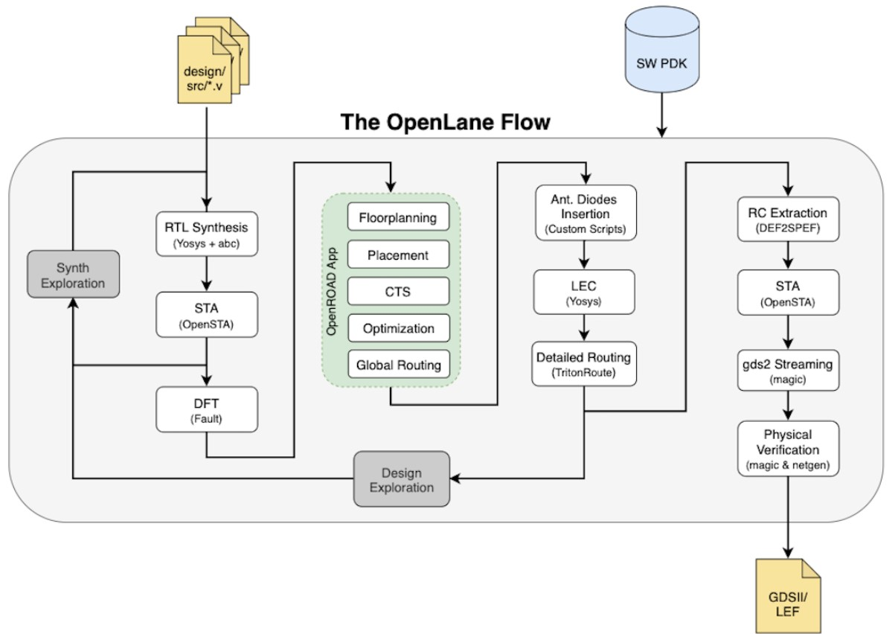
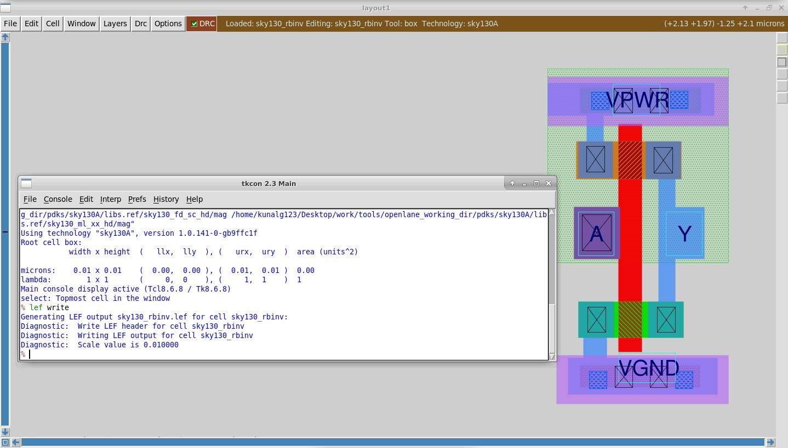

# <p align="center"> Advanced Physical Design Workshop on OpenLANE using Skywater 130nm PDK </p>

# <p align="center"> Introduction </p>
ASIC design is an involved process. In the distant past (few decades ago), ASIC designers were people who designed powerful processors (think Intel 8080 microprocessor) using "[rubylith](https://en.wikipedia.org/wiki/Rubylith), light boards, rulers, electric erasers, and a [digitizer](https://en.wikipedia.org/wiki/Digitization)" [[1]](https://en.wikipedia.org/wiki/Intel_8086). Soon people began realizing how useful these tiny things called processors were in making their lives better and within a year (1974), MITS released their legendary [Altair 8800](https://en.wikipedia.org/wiki/Altair_8800) microcomputer. And, thus, the fascinating story of how humanity's search to automatically add decimal numbers (in 1812 by Charle's Babbage) [3] took a much-needed turn into the right direction, which was to make that technology available to everyday people. This led people to start thinking of new ways to design these pretty tiny but huge pieces of silicon. And that is everyone was rushing to design Electronic Design Automation (EDA) tools and make money out of them. Quickly, within a span of few years, companies started designing tools to design Very Large Integrated Circuits (VLIC) very quickly. And, thus, the very end of 1900s started the very beginning of new technological era, an era that would create the most technological acceleration than what humans had achieved throughout their entire existence. Somewhere in this acceleration, companies that specialized in these EDA tools and chip fabrication were becoming giants providing services to other companies, yet still out of reach of the everyday people. In few decades of their existence, these companies had created proprietary technologies that allowed them to share the whole IC design and fabrication market share between themselves (huge investments lead to huge gains). Then came the open-source revolution for software and hardware. In this open-source revolution, people started contributing to projects that are available in public (including the source and designs) so that everybody could collectively work on it and further the given project (think Linux). Then came the [OpenROAD project](https://openroad.readthedocs.io/en/latest/) in 2018 and with the release of the [Skywater 130nm PDK](https://github.com/google/skywater-pdk), the momentum of open-source IC design is gradually shifting towards the everyday people and that is why we are here, to get started in the path to learning these open-source EDA tools and PDKs.


[Symbol Legend]  

:pushpin: - Yet to do   

:construction: - Currently doing 

:100: - Completed

:triangular_flag_on_post: - Note


# <p align="center"> Table of Contents </p>
| Day | Module |Part|                          Topic                                       | Status  |
|:---|:------|:------|:--------------------------------------------------------------------|:-------:|
| 1   |        |       |[Inception of open-source EDA, OpenLANE, and Sky130 PDK](https://github.com/rajivbishwokarma/openlane_rtl2gds_sky130#-day-1-inception-of-open-source-eda-openlane-and-sky130-pdk)           | :construction:|
|     |        |       | [Simplified RTL to GDSII Flow](https://github.com/rajivbishwokarma/openlane_rtl2gds_sky130#simplified-rtl-to-gdsii-flow)        |    :100:     |
|     |        |       | [OpenLANE Architecture](https://github.com/rajivbishwokarma/openlane_rtl2gds_sky130#openlane-architecture)        |    :100:     |
|     |        |       | [Starting the OpenLANE Flow](https://github.com/rajivbishwokarma/openlane_rtl2gds_sky130#starting-the-openlane-flow)        |    :100:     |
| 2   |        |       |[Good floorplan vs bad floorplan and introduction to library cells](https://github.com/rajivbishwokarma/openlane_rtl2gds_sky130#day-2-good-floorplan-vs-bad-floorplan-and-introduction-to-library-cells)        |   :100:      |
|     | SK1    |       | [Chip floor planning considerations](https://github.com/rajivbishwokarma/openlane_rtl2gds_sky130#sk1-power-planning-and-floor-planning)        |    :100:     |
|     |        |  L1   | [Utilization Factor and Aspect Ratio](https://github.com/rajivbishwokarma/openlane_rtl2gds_sky130#-utilization-factor-and-aspect-ratio) |   :100: |
|     |        |  L2   | [Pre-placed cells](https://github.com/rajivbishwokarma/openlane_rtl2gds_sky130#-pre-placed-cells) |  :100:  |
|     |        |  L3   | [Decoupling capacitors](https://github.com/rajivbishwokarma/openlane_rtl2gds_sky130#-decoupling-capacitors) | :100:   |
|     |        |  L4   | [Power Planning](https://github.com/rajivbishwokarma/openlane_rtl2gds_sky130#-power-planning) | :100:   |
|     |        |  L5   | [Pin placement and logic cell placement blockage](https://github.com/rajivbishwokarma/openlane_rtl2gds_sky130#l5-pin-placement-and-logical-cell-placement-blockage) |   :100: |
|     |        |L6-LAB | [Steps to run floorplan using OpenLANE](https://github.com/rajivbishwokarma/openlane_rtl2gds_sky130#l7-review-floorplan-files-and-steps-to-view-floorplan) |  :100:  |
|     |        |L7-LAB | [Review floorplan files and steps to view floorplan](https://github.com/rajivbishwokarma/openlane_rtl2gds_sky130#) | :100:   |
|     |        |L8-LAB | [Review floorplan layout in Magic](https://github.com/rajivbishwokarma/openlane_rtl2gds_sky130#l8-review-floorplan-layout-in-magic) |  :100:  |
|     | SK2    |       | [Library Binding and Placement](https://github.com/rajivbishwokarma/openlane_rtl2gds_sky130#sk2-library-binding-and-placement)        |    :100:     |
|     |        |  L1   | [Netlist binding and initial place design](https://github.com/rajivbishwokarma/openlane_rtl2gds_sky130#l1-netlist-binding-and-initial-place-design) |  :100:       |
|     |        |  L2   | [Optimize placement using estimated wire-length and capacitance](https://github.com/rajivbishwokarma/openlane_rtl2gds_sky130#l2-optimize-placement-using-estimated-wire-length-and-capacitance) |   :100:      |
|     |        |  L3   | [Final placement optimization](https://github.com/rajivbishwokarma/openlane_rtl2gds_sky130#l3-final-placement-optimization) |  :100:       |
|     |        |  L4   | [Need for libraries and characterization](https://github.com/rajivbishwokarma/openlane_rtl2gds_sky130#l4-need-for-libraries-and-characterization) |  :100:       |
|     |        |L5-LAB | [Congestion aware placement using RePlAce](https://github.com/rajivbishwokarma/openlane_rtl2gds_sky130#l5-congestion-aware-placement-using-replace) |  :100:       |
|     | SK3    |       | [Cell design and characterization flows](https://github.com/rajivbishwokarma/openlane_rtl2gds_sky130#sk3-cell-design-and-characterization-flows)        |   :100:     |
|     |        |  L1   | [Inputs for cell design flow](https://github.com/rajivbishwokarma/openlane_rtl2gds_sky130#l1-inputs-for-cell-design-flow) |  :100:       |
|     |        |  L2   | [Circuit design step](https://github.com/rajivbishwokarma/openlane_rtl2gds_sky130#l2-circuit-design-step) |   :100:      |
|     |        |  L3   | [Layout design step](https://github.com/rajivbishwokarma/openlane_rtl2gds_sky130#l3-layout-design-step) |  :100:      |
|     |        |  L4   | [Typical characterization flow](https://github.com/rajivbishwokarma/openlane_rtl2gds_sky130#l4-typical-characterization-flow) |  :100:       |
|     | SK4    |       | [General timing characterization parameters](https://github.com/rajivbishwokarma/openlane_rtl2gds_sky130#sk4-general-timing-characterization-parameters)        |  :100:    |
|     |        |  L1   | [Timing threshold definition](https://github.com/rajivbishwokarma/openlane_rtl2gds_sky130#l1-timing-threshold-definition) |   :100:     |
|     |        |  L2   | [Propagation delay and transition time](https://github.com/rajivbishwokarma/openlane_rtl2gds_sky130#l2-propagation-delay-and-transition-time) |  :100:     |
| 3   |        |       | [Design library cell using Magic Layout and ngspice characterization](https://github.com/rajivbishwokarma/openlane_rtl2gds_sky130#-day-3-design-library-cell-using-magic-layout-and-ngspice-characterization-) | :100:  |
|     |   SK1  |       | [Labs for CMOS inverter ngspice simulation](https://github.com/rajivbishwokarma/openlane_rtl2gds_sky130#sk1-labs-for-cmos-inverter-ngspice-simulation)        |  :100:    |
|     |        |  L1   | [IO Placer Revision](https://github.com/rajivbishwokarma/openlane_rtl2gds_sky130#l0-io-placer-revision)        |  :100:    |
|     |        |  L2   | [SPICE deck creation for CMOS inverter](https://github.com/rajivbishwokarma/openlane_rtl2gds_sky130#l1-spice-deck-creation-for-cmos-inverter-vtc)        |  :100:    |
|     |        |  L3   | [Switching Threshold](https://github.com/rajivbishwokarma/openlane_rtl2gds_sky130#l3-switching-threshold-v_m)        |  :100:    |
|     |        |  L4   | [ Static and dynamic simulation of CMOS inverter](https://github.com/rajivbishwokarma/openlane_rtl2gds_sky130#l4-static-and-dynamic-simulation-of-cmos-inverter)        |  :100:    |
|     |        |  L5   | [ Git clone the VSD standard cell](https://github.com/rajivbishwokarma/openlane_rtl2gds_sky130#l5-git-clone-the-vsd-standard-cell)        |  :100:    |
|     |   SK2  |       | [Inception of Layout and CMOS fabrication process](https://github.com/rajivbishwokarma/openlane_rtl2gds_sky130#sk2-inception-of-layout-and-cmos-fabrication-process)        |  :100:    |
|     |   SK3  |       | [Sky130 Tech File Labs](https://github.com/rajivbishwokarma/openlane_rtl2gds_sky130#sk3-sky130-tech-file-labs)        |  :100:    |
|     |        |  L1   | [Lab steps to create final SPICE desk using Sky130 tech](https://github.com/rajivbishwokarma/openlane_rtl2gds_sky130#l1---lab-steps-to-create-final-spice-desk-using-sky130-tech)        |  :100:    |
| 4   |        |       | [Pre-layout timing analysis and importance of good clock tree](https://github.com/rajivbishwokarma/openlane_rtl2gds_sky130#-day-4-pre-layout-timing-analysis-and-importance-of-good-clock-tree-)      | :construction: |
|     |   SK1  |       | [Timing modelling using delay tables](https://github.com/rajivbishwokarma/openlane_rtl2gds_sky130#sk1-timing-modelling-using-delay-tables)        |  :100:    |
|     |        |  L1   | [Lab steps to convert grid info to track info](https://github.com/rajivbishwokarma/openlane_rtl2gds_sky130#1-lab-steps-to-convert-grid-info-to-track-info)        |  :100:    |
|     |        |  L2   | [Lab steps to convert magic layout to std cell LEF](https://github.com/rajivbishwokarma/openlane_rtl2gds_sky130#2-lab-steps-to-convert-magic-layout-to-std-cell-lef)        |  :100:    |
|     |        |  L3   | [Introduction to timing libs and steps to include new cell in synthesis](https://github.com/rajivbishwokarma/openlane_rtl2gds_sky130#3-introduction-to-timing-libs-and-steps-to-include-new-cell-in-synthesis)        |  :100:    |
|     |   SK3  |       | [Running CTS using TritonCTS](https://github.com/rajivbishwokarma/openlane_rtl2gds_sky130#sk3---running-cts-using-tritoncts)        |  :construction:    |
| 5   |        |       | [Final steps for RTL2GDS using tritonRoute and openSTA]()             | :construction: |


#
#
#
#
# <p align="center"> Day 1: Inception of open-source EDA, OpenLANE and Sky130 PDK</p>

## Simplified RTL to GDSII Flow


A simplified step from RTL to GDSII consists of the blocks shown in the image above. The OpenLANE flow takes in the RTL from your design and the PDKs provided by the foundries. Then, everything else is automated. OpenLane's architecture is shown below.


## OpenLANE Architecture


OpenLANE aims to be a completely automated tool with no-human-in the loop. During these series of lectures, and labs. The following tools from OpenLANE will be extensively used. The complete list can be found [here](https://openlane.readthedocs.io/en/latest/flow_overview.html).

|        Tool        |       Description         |
|:------------------:|:-------------------------:|
|     yosis/abc           | Synthesizing RTL and maping it to technology |
|     init_floorplan      | Running floorplan |
|     ioplacer            | Placing the input and output ports |
|     pdngen              | Generate PDN |
|     tap_decap_or        | Place welltap and decap cells |
|     RePlAce             | Performs global placement |
|     TritonCTS           | Clock tree synthesis | 
|     FastRoute           | Global routing for guide generation for detailed routing |
|     TritonRoute         | Detailed routing |
|     Magic               | Viewing layout, doing DRC checks |


## Start the docker environment
After we **cd** into the following folder, we can start the environment with the **docker** command. Also, the newer version expects the **make mount** comand for the docker to start.
```
~/Desktop/work/tools/openlane_working_dir/openlane/
```


## Starting the OpenLANE Flow
We use the following command to run the OpenLANE flow and we use the **-interactive** switch to make all the steps interactive.

```
./flow.tcl -interactive
```
We are then greeted with the OpenLANE welcome screen. Then, we will have to type the following commands to initialize the openlane packages and then to prepare our design.

```
package require openlane 0.9

prep -design picorv32a
```
This can be seen in the following screenshot. 


Then, we run synthesis using the following command.

```
run_synthesis
```

This will create a **run** folder inside the **(OPENLANE)/designs/picorv32a/** directory. This can be seen in the image below.


#
#
# <p align="center"> Day 2: Good floorplan vs bad floorplan and introduction to library cells </p>
##  **SK1: Power planning and floor planning**
This section covers multiple topics ranging from utilization factor, aspect ratio, pre-placed cells and de-coupling capacitors to power planning and floor planning.

### **[L1] Utilization factor and aspect ratio**

__Utilization factor refers to how much of the total area of the core are you using to place your logic.__ Using the following figure, for example, if a core has an area of 4 * 2 sq. unit and your logic uses four standard cells, each of area 1 sq. unit, which totals to 4 * 1 sq. unit = 4 sq. unit then your utilization factor can be calculated with the following formula.

<p align="center">

</p>

$$ Utilization\ Factor = \frac{Area\ occupied\ by\ the\ netlist}{Total\ area\ of\ the\ core} $$

For the above given data, 
```
Utilization factor = (4 * 1 sq. unit) / ( 4 * 2 sq. unit) = 0.5
```

**Aspect ratio is the ratio between height to width of your logic area.** Using the data from above example, you can calculate the aspect ratio using the following formula.

$$ Aspect\ Ratio = \frac{Height}{Width} $$

For the example above, 
```
Aspect ratio = 2 unit / 4 unit = 0.5
```

Therefore, utilization factor basically measure how much physical space in the core your logic blocks have used and how much space is remaining for your routing and logic cells. Aspect ratio, on the other hand tells you the shape of your core. 

### **[L2] Pre-placed cells**
These are the modules that are in the top level design and reused multiple times, however, instead of instantiating them in multiple locations they are place in in one location and then connections are routed to and from wherever they are needed. Their location is fixed during the whole design cycle and the automatic placement tool will not move them, rather the automatic placement tool will place other modules by condering these modules. 


### **[L3] Decoupling capacitors**
When the physical distance between the power source and a certain pre-placed cells is high, some power will be lost due to the resistance of the wires. Therefore, we need to surround the pre-placed cells with decoupling capacitors. We do this to make sure that when the output switches from logic zero to logic one, the high output is within noise margin (as shown in left figure below). The capacitors are placed as shown in right figure below.

<p float="left">
    
    
</p>

### **[L4] Power Planning**
Voltage droop can occur during a simultaneous low to high transition (or ground bounce during high to low) in, say, a 32-bit bus when the physical distance between the power source and power target components is high. It is not feasible to place decoupling capacitors everywhere to resolve this issue as we won't have enough area to implement our own logic. Therefore, the most efficient method of solving this problem is to create a grid of power sources that span the whole core area, and, thus, provide enough power to all the components. This grid can be seen in the following image.

<p align="center">
    
</p>

In the above image, each pair of VDD and VSS wire is one source and they are routed so that they cover the entire area of the chip.

### **[L5] Pin placement and logical cell placement blockage**
Pinn placement refers to the arrangement of the input and output pins of the design in the most efficient way possible within the mmodule For example, an equivalent pin placement (right) of a logic circuit (left) is given below.

<p float="left">
    
    
</p>

As can be seen from both the images, the inputs and outputs will be placed somwhere close to the module that it belongs to. However, if there any any pre-placed cells in the design, then pre-placed cells' area will be avoided during both the placement of the logic module and routing of the logic module. On interesting point about the pin placement above is the *Clk Out* signal, which is far from *Block b*; this choice of design is made to reduce the number of decoupling capacitors in the module. The fact that simply placing buffers to resolve any irregularities in the signal propagation overcomes the placement of any unnecessary capacitive circuit behavior. Also, it must be noted that the clock ports are wider than other signal ports, this is done because it is necessary to reduce the resitance to the clock as much as possible as everything depends on the clock. Then, finally, this area is blocked to make sure that no logical cells are placed in this part of the core. After the area is blocked, this floorplan is ready for placement and routing. 


### **[L6] Steps to run floorplan using OpenLANE**
<p align="center">

```
[Quick Review] In the last lab, we completed the design preparation step and design synthesis step. We used the following commands to do so.

1. We started out docker environment with: docker
2. We started OpenLANE flow with: ./flow.tcl -interactive
3. We initialized our environment with: package require openlane 0.9
4. We prepared out design with: prep -design picorv32a
5. We synthesized the design with: run_synthesis
```
</p>

In today's lab, we are going to run the steps to do floorplanning in OpenLANE. To do that, we will continue after we ran the synthesis for the **picorv32a** module.

The command to run the floorplanning is simple, just like the syntheis, and you can run this step using the following statement.
```
run_floorplan
```
However, before we do that, it is necessary to understand the different switches that are passed to this command that will change the behavior of the underlying scripts. All of these switches can be studied [**here**](https://openlane.readthedocs.io/en/latest/reference/configuration.html#floorplanning). As mentioned [**here**](https://openlane.readthedocs.io/en/latest/usage/hardening_macros.html#floorplan), it is possible to run the floorplanning in one of the three ways, which can be differentiated based on automatic or manual selection of area. 

These switches can be modified in the files located in the **configuration** folder within openlane directory as shown in the [**OpenLANE configuration directory**](https://github.com/The-OpenROAD-Project/OpenLane/tree/master/configuration) and in the image below.
<p align="center">
    
</p>

### **[L7] Review floorplan files and steps to view floorplan**

The switches for the step can be set in one of the three files and the precedence is set according to the order below.
1. Technology configuration file ([sky130A_sky130_fd_sc_hd_config.tcl](https://github.com/The-OpenROAD-Project/actions-test/blob/main/sky130A_sky130_fd_sc_hd_config.tcl))
2. Design configuration file ([config.json](https://github.com/The-OpenROAD-Project/OpenLane/blob/master/designs/picorv32a/config.json))  [*note: the new version of the OpenLANE flow uses **config.json** whereas the older version used [config.tcl](https://github.com/The-OpenROAD-Project/actions-test/blob/main/config.tcl)*]
3. OpenLANE default configuration file ([floorplan.tcl](https://github.com/The-OpenROAD-Project/OpenLane/blob/master/configuration/floorplan.tcl))

*[NOTE: the files shown in the links are just examples, to actually set the value you will have to change the parameters in the current design directory of **your** project]*

For the current run, we are setting the values to the default as they are in those files. Running the command, we get the following output (left). It will shortly end and should end with a successful message (right) 
<p float="left">
    
    
</p>

### **[L8] Review floorplan layout in Magic**
After the above step, the floorplanning is completed and it can be opened with **magic** to see the result and analyze the effect of the parameters that were set in the initial configuration files.
```
Command syntax: magic -T <path-to-sky130A.tech> lef read <path-to-merged.lef> def read <path-to-picorv32.floorplan.def>

Command: magic -T ~/Desktop/work/tools/openlane_working_dir/pdks/sky130A/libs.tech/magic/sky130A.tech lef read ../../tmp/merged.lef def read picorv32a.floorplan.def &
```


This will open up magic with the result of the floorplan as shown below (left). We can play around with the view to see the pad placement and the cells placed in the design (right).

<p align="center">
    
    
</p>

With this, we are done with the floorplanning step.

---


## **SK2: Library Binding and Placement**
### **[L1] Netlist binding and initial place design**
Before a placement of the logical blocks in the physical core can be done, each components in the design module needs to have an equivalent standard cell. The process of assigning each logial block (think NOT, AND, OR, ...) an equivalent physical standard cell (from the given technology, Sky130, for example) is called netlist binding. These equivalent standard cells are then placed in the core so that each design is as close to other connected module and input/output pads. In the following images, this process can be visually inspected from the initial netlist (1) to the final placement (4). 

<p align="center">
    
</p>

### **[L2] Optimize placement using estimated wire-length and capacitance**
If you noticed, we did not place all the logic blocks in the core in [SK2-L1] i.e., last two blocks from the netlist. This is because we need to optimize how these modules are placed in the core to properly maintain the signal integrity between the sender and receiver blocks. The issue of signal integrity comes into play becasue of the distance between two connecting modules. In case of the third module (green), there is a pre-placed cell between the input and ouptut, and therefore, we have to adjust the placement accordingly. In case of the second module (yellow), there is still significant distance between the input (Din2) and the first receiver (FF1), and with such kind of distance, we cannot gurantee the maintainence of the signal. Therefore, we estimate the wire length and capacitance of the wire and place buffers (as repeaters) between these two components so as to keep the signals intact. This can be seen in the figure below. However, adding additional logic of course increases the delay of the signal. How does this delay affect the overall timing? We will see this in a later timing analysis.

<p align="center">
    
</p>

### **[L3] Final placement optimization**
Now, the routing of modules 3 and 4 (blue and green blocks) present another set of obstacles in the physical design of this module. You can see from the image above that we had to place each components of the same module fairly separate from each other. We have done this so that we can properly route all the modules. In the images below, we can see how both the third (left) and fourh (right) modules are routed using buffers (or routers) in between the logic blocks. Again, this is done by estimating the wire length and chapacitance of the wire when the distance is too large. This estimation is done using slew (or transition) analysis.

:interrobang: [Question] Why did we not follow the same routing principle that we followed for the second module (yellow) [[abutment](https://www.synopsys.com/glossary/what-is-custom-ic.html)]. We could have placed all the logic components for modules 3 and 4 together and then placed buffers all the way from the input to the first flip-flop. The number of buffers in both cases should be the same.

<p align="left">
    
    
</ p>

### **[L4] Need for libraries and characterization**
Everything in the real world is analog and we are using digital design to create analog components. Along the way, we need analog models of the components that we are designing so that we know they will function in the real world. That is, we need analog power and speed characteristics of all the gates (NOT, NAND, NOR, ..) and logic modules (memories) we are using and this is standard cell and library characterization [[Source](https://www.synopsys.com/glossary/what-is-library-characterization.html)]. And, this is a must for any efficient design flow.


### **[L5] Congestion aware placement using RePlAce**
:triangular_flag_on_post: [Note: as of January 26, 2023 the [RePlAce repo](https://github.com/The-OpenROAD-Project/RePlAce) has been archieved in November 8, 2022].

Now we will carry out the physical placement of the standard cells using the RePlAce (Advancing Solution Quality and Routability Validation in Global Placement) tool in OpenLANE. In OpenLANE, placement occurs in two stages: global and detailed. Global placement is a coarse (approximate) placement and the detailed placement is a legal (abutment and no overlap) way of placing for the timing. We can run the placement using the following command. 

```
run_placement
```

When we do this, the placement process starts and this can be seen in the following screenshots of the output window.
<p align="left">
    
    
</p>

We can go ahead and view this implemented placement using **magic**. To do this, we use a similar command to that of the floorplanning. The implemented design is available under **placement** directory inside the **result** folder. Therefore, **cd** into the **placement** folder and run the following command. If you notice carefully, this time we are using **picorv32a.placement.def** instead of the *picorv32a.floorplan.def* file that we previously used.

```
Command: magic -T ~/Desktop/work/tools/openlane_working_dir/pdks/sky130A/libs.tech/magic/sky130A.tech lef read ../../tmp/merged.lef def read picorv32a.placement.def &
```


Zooming into one of the regions, we see that the standard cells are placed and arranged properly in the slots. 

<p align="left">
    
    
</p>

This concludes the placement step in OpenLANE flow.

## **SK3: Cell design and characterization flows**
A cell design flow consists three main steps:
+ Inputs
+ Design Steps
+ Outputs


### **[L1] Inputs for cell design flow**
A typical standard cell for, say, an inverter has to go through a cell design flow before it can be used to design an IC. This design flow consists of using analog characteristic analysis of the cell using SPICE simulation, DRC, and LVS. Every single standard cell in a library, which can contain multiple variation of the same standard cell with different drive strength and/or different size, has to go through this process. The parameters that are used for the simulation are provided by the foundries and a collection of all these components used to create standard cells is called a **Process Design Kit (PDK)**.

Specifically, inputs for a cell design flow can be listed as: 
* Process Design Kits (PDKs):
  * Design Rule Check (DRC)
  * Layout vs Simulation (LVS)
  * SPICE models
  * Library 
  * User-defined specs
    * Cell height
    * Supply voltage
    * Metal layer placements
    * Drawn gate-length

### **[L2] Circuit design step**
Design involves the use of the cells obtained as the inputs. The circuit design step involves the designing of the circuit using nMOS, pMOS transistors so that they meet the minimum requirements asked by the foundries. Function implementation, transistor sizing, saturation characterization and voltage calculation are some of the steps of circuit design. The output of this step is called Circuit Description Language (CDL).

### **[L3] Layout design step**
From the implemented circuit, pMOS network graph and nMOS network graph are extracted and the Euler's path is obtained. Now, Euler's path is used to design the stick diagram, which is a literal representation of the physical layout that will be laid out as the result of all of this flow. This stick diagram must adhere to the design rules given by the foundry. The output of this step will be the following. 
* GDSII: It contains the layout file
* LEF: It defines the width and height of the cell
* Extracted SPICE netlist (.cir): It contains all the parasitics i.e., resistance and mainly capacitances of all the elements in the circuit.

### **[L4] Typical characterization flow**
Following steps can be typically followed to carry out a characterization flow. 
1. Read the NMOS and PMOS models provided by the foundry. 
2. Read the extracted SPICE netlist
3. Define and recognize the behavior of the cell
4. Read the sub-circuit of the required module
5. Attach the necessary power sources. 
6. Apply the stimulus to the module. 
7. Provide the necessary output capacitance (by varying in a range).
8. Provide the necessary simulation commands (**.tran** for transient simulation, **.dc** for DC simulation)
9. Feed all the data from step 1 to step 8 as a configuration file to [GUNA](https://www.paripath.com/Products/Guna).

The characterization is the extraction of timing, power, and parasitics information of the given design. The output from this steps are given below. The outputs are **.lib** files with following information.
* Timing data
* Noise data
* Power data
* Function data

## **SK4: General timing characterization parameters**

### **[L1] Timing threshold definition**

The following variables are used in GUNA to do timing characterization. The cuve column represents the color of the plot shown in the following graph. The graph is associated with a buffer (two inverts placed in a cascade) as shown in the schematic image below. For the first plot the blue waveform is the input to the second inverter while the red waveform is the output from the buffer (or output from the second inverter). For the middle plot, the red waveform is the input stimulus to the first inverter and the blue waveform is the output from the first inverter (see how similar two output waveforms in both plots are). The last plot also represents the input and output for the first ineverter, the only difference is that the stimulus is transitioning from high to low in this case.

<p align="center">
    
</p>

<p align="center">
    
    
    
</p>

<p>
<table align="center">
<tr><th> <p align="center"> Output Waveform </p></th><th> <p align="center">  Input Waveform </p></th></tr>
<tr><td>

|Timing threshold variables| Curve (Plot-1) | Definition|
|:--------------------| :----|:-----|
|    slew_low_rise_thr  | Red| Slew rate (solpe) near to zero (typically 20% to 30% of VDD) |
|    slew_high_rise_thr | Red | Slew rate near to high voltage (typically 80% of VDD)  |
|    slew_low_fall_thr  | Blue| Slew rate near to VSS (20% of VDD) |
|    slew_high_fall_thr | Blue| Slew rate near to VDD (80% of VDD)  |
</td><td>

|Timing threshold variables| Curve (Plot-2-3) | Definition|
|:--------------------| :----|:-----|
|    in_rise_thr      | RED (Plot 2)  | 50% value of the input waveform  |
|    in_fall_thr      | RED (Plot 3)  | 50% value of the input waveform  |
|    out_rise_thr     | BLUE (Plot 2) | 50% value of the output waveform |
|    out_fall_thr     | BLUE (Plot 3) | 50% value of the output waveform |

</td></tr> </table>
</p>

Delays are calculated, for example, in the input side by taking the 50% values from the stimulus and output and subtracting them. This is how GUNA calculates the delays for timing threshold variables.


### **[L2] Propagation delay and transition time**

As stated earlier, the delay can be calculated using the following formula: 

$$ delay = time(out\\_ \* \\_thr) \ - \ time(in\\_ \* \\_thr) $$


Similarly, transition time for a rising waveform can be calculated as, 


$$ transition\ time_{rising} = time(slew\\_high\\_rise\\_thr) - time(slew\\_low\\_rise\\_thr) $$


And, transition time for a falling waveform can be calcualted as,


$$ transition\ time_{falling} = time(slew\\_high\\_fall\\_thr) - time(slew\\_low\\_fall\\_thr) $$


#

#

#
# <p align="center"> **Day-3: Design library cell using Magic Layout and ngspice characterization** </p>
## SK1: Labs for CMOS inverter ngspice simulation
### L0: **IO placer revision**
Previously, we ran a floorplanning step with a value of '1' to the **FP_IO_MODE** flag within **floorplan.tcl** file inside the configuration directory. The result was a placement of equidistant pin-pads in the core. Now, we re-run the same step with a value of '2' set to the flag. The result we expect is not equidistant but an overlap in the pad placement. 

To change the value and rerun, we run the following commands inside the OpenLANE environment. 
```
set ::env(FP_IO_MODE) 2
run_floorplan
```
<p align="center">
    
</p>

Then, after the floorplan is completed, we can open the result using the same magic command that we previously used. Make sure to **cd** into the appropriate result directory. 

```
magic -T ~/Desktop/work/tools/openlane_working_dir/pdks/sky130A/libs.tech/magic/sky130A.tech lef read merged_unpadded.lef def read picorv32a.floorplan.def & 
```
In the images below (left), we can already see how the change has occured. Notice how all the pads are placed on the left and right, compared to how they were spread accross all the sides in the previous run. Zooming in (right), it is clear how pads are overlapping with each other in this run.

<p align="center">
    
    
</p>


### **L1: SPICE deck creation for CMOS inverter [VTC]**
First step for before running a SPICE simulation is to create a SPICE deck. SPICE deck is a netlist containing all the connectivity information (inputs, tap points). 

Netlist creation for a simple inverter circuit with following specification (values and nodes).

<p align="center">
    
    <p align="right">
        
        *** MODEL Description ***
        *** NETLIST Description ***
        M1 out in vdd vdd pmos W=0.375u L=0.25u
        M2 out in  0   0  nmos W=0.375u L=0.25u

        cload out 0 10f

        Vdd vdd 0 2.5
        Vin in  0 2.5

        *** Simulation Commands ***
        .op

        *** Sweep Vin from 0 to 0.5 at 0.05 increment ***
        .dc Vin 0 2.5 0.05

        *** include model files ***
        .LIB "tsmc_025um_model.mod" CMOS_MODELS
        .end
</p> </p>

### **L2: SPICE Simulation lab for CMOS inverter**
Running simulation with ngspice with two sets of parameters as shown below will result in the graphs below.

| Spec 1  | Spec 2|
|:-------:|:-----:|
| W_n=0.375  W_p=0.375u  L_np=0.25u    |       W_n= 0.375  W_p=0.9375u  L_np=0.25u    |
| W_n/L_n = W_p/L_p = 1.5              |       W_n/L_n = W_p/L_p  = 3.75              |

<p align="center">


</p>

### **L3: Switching Threshold $V_m$**
Switching threhold is a point at which the device switches. To find this, we draw a 45 degree line that intersects the characteristic curve of the inverter as shown in figure below.


From visual inspection, it can be seen that the threshold values for the given waveforms are approximately around 0.98V for Spec-1 and 1.2 for Spec-2.

### **L4: Static and dynamic simulation of CMOS inverter**
Dynamic simulation is done in the same way as we did the static simulation in the previous section. The only difference is that, here, we provide a pulse as an external stimulus. We do this by using the following command in the SPICE circuit. 

In the previous netlist, we had: **Vin in  0 2.5** as the input stimulus. We replace that with the following power source input.

```
Vin in 0 0 pulse 0 2.5 0 10p 10p 1n 2n
```
And, then we replace **.dc Vin 0 2.5 0.05** with the transient simulation command.

```
.tran 10p 4n 
```

So, the complete model becomes. 
```
*** MODEL Description ***
*** NETLIST Description ***
M1 out in vdd vdd pmos W=0.375u L=0.25u
M2 out in  0   0  nmos W=0.375u L=0.25u

cload out 0 10f

Vdd vdd 0 2.5
Vin in 0 0 pulse 0 2.5 0 10p 10p 1n 2n

*** Simulation Commands ***
.op
.tran 10p 4n 

*** include model files ***
.LIB "tsmc_025um_model.mod" CMOS_MODELS
.end
```

Simulating the above model in **ngspice** results in the following waveform. 

<p align="center">
    
</p>

### **L5: Git clone the VSD standard cell**
Before we proceed, we need to have a standard cell. But, for this module, we are going to use a pre-designed standard cell from this [GitHub Repo](https://github.com/nickson-jose/vsdstdcelldesign).

Clone the repo into your **openlane** directory. And, you are ready to go.
<p align="center">
    
</p>

## **SK2: Inception of Layout and CMOS fabrication process**
### L1: Create active regions
16-mask CMOS process
 1. Selecting a substrate 
    * P-type
    * High resistivity (5~50 ohms)
    * Doping level ($10^{15} \ cm^{-3}$)  (less than well-doping)
    * Orientation (100) 

 2. Creating active region for transistors
    * Grow ~40nm of $SiO_{2}$
    * Deposit ~80nm of $Si_{3}N_{4}$ on top of $SiO_{2}$
    * Deposit ~1um photoresist 
    * Create Mask1 on top of photoresist
    * Wash out using UV
    * Remove Mask1
    * Etch off $Si_{3}N_{4}$
    * Remove photoresist
    * Place it in an oxidation furnance
    * Do LOCOS (Local Oxidation of Silicon)
    * Etch off $Si_{3}N_{4}$ completely using hot phosporic acid

### L2: Formation of N-well and P-well

 3. N-Well and P-Well formation
    * Deposit photoresist
    * Create Mask2
    * Shine UV light and wash off partial photoresist
    * Remove the Mask2
    * Diffuse Boron to create P-well (~200keV)
    * Repeat the steps for creating N-well using Mask3 and Phosphorous (~400keV)
    * Diffuse the wells using driving furnance (twin-tops)

### L3: Formation of gate terminal

**Threhold Voltage Equation**

$$ V_t = V_{t0}  + \gamma (\sqrt{|-2 \phi_{f} + V_{sb}|} - \sqrt{|-2 \phi_f|} ) $$

where, 

$$ \gamma = \frac{\sqrt{2qNA \epsilon_{si} }}{C_{ox}} $$

:pushpin: And, the meaning of the symbols are as follows. 

4. Formation of 'gate'
   * Deposit photoresist and Mask4 on N-well side
   * Introduce controlled Boron at ~60keV to create nMOS
   * Repeat the same step to the P-well using Arsenic and create pMOS
   * Remove the oxide layer using diluted hydrofluric (HF) solution
   * Re-grow high quality oxide (~10nm thin) 
   * Deposit ~0.4um polysilicon layer
   * Add N-type (phosphorous or arsenic) ion implants
   * Deposit photoresist and Mask6
   * Etch unnecessary polysilicon


### L4: Lightly doped drain (LDD) formation
 5. Lighly doped drain (LDD) formation
    * P+, P-, N profile for pMOS
    * N+, N-, P profile for nMOS
    * Hot electron effect
    * Short channel effect

### **L8: Lab introduction to Sky130 basic layers layout and LEF using inverter**
We use **magic** to view the standard cell that we cloned from the [GitHub Repo](https://github.com/nickson-jose/vsdstdcelldesign) in the previous lab session. After the cloning is done, we can use magic to see the layout of the inverter. 

After we are in the **openlane** directory We use the following command to do so.\
```
magic -T sky130A.tech sky130_inv.mag &
```
<p align="center">
    
</p>

This will show the following window in **magic**.
<p align="center">
    
</p>

In this window, we can see all the information about the substratees, CMOS gates, contacts and layer coloring information. For example, to see information about a particular section, say, the cross-section between n-diffusion and poly, we can over our cursor over the region and select it. Then by opning the main **magic** window, we can type down **what** command to see the information as can be seen from the screenshots below. 

<p align="left">
    
    
</p>

Another command that we can use is press '**s**' thrice after hovering the cursor over a partiular region. This will allow you to see the connection of the region to other regions. For example, in the screenshots bewlow, the 's' was pressed thrice after the cursor was over the contact (left). This selected the complete connection of the contact, then, using **what** in the main window resulted in the message being displayed (right).

<p align="left">
    
    
</p>

Another important file type to consider is the **LEF** filetype. These is a logic-less file only containing the metal contacts and boundaries. This file is used by foundries to protect their IPs as only metal contacts and boundires are enough to fabricate the chips.


### L9: Lab steps to create std cell layout and extract spice netlist
:pushpin: For this example, the provided **sky130_inv.mag** is used. Therefore, to open this design, use the following command. 

```
magic -T sky130A.tech sky130_inv.mag &
```

The command to extract the netlist after creating the standard cell in **magic** is given below. 

```
extract all
ext2spice cthresh 0 rthresh 0
ext2spice
```
After these commands are executed, as shown in the figure below.
<p align="center">
    
</p>
The following files will be created as shown below.

```
sky130_inv.ext
sky130_inv.spice
```
<p align="center">
    
</p>

Inside the SPICE file, following can be found, which basically are the connection information and capacitance information about the internal circuit of the inverter.

```python
* SPICE3 file created from sky130_inv.ext - technology: sky130A

.option scale=0.10000u

.subckt sky130_inv A Y VPWR VGND
X0 Y A VGND VGND sky130_fd_pr__nfet_01v8 ad=0 pd=0 as=0 ps=0 w=35 l=23
X1 Y A VPWR VPWR sky130_fd_pr__pfet_01v8 ad=0 pd=0 as=0 ps=0 w=37 l=23
C0 A VPWR 0.07fF
C1 A Y 0.05fF
C2 Y VPWR 0.11fF
C3 Y VGND 0.24fF
C4 VPWR VGND 0.59fF
.ends
```

## **SK3: Sky130 Tech File Labs**
### **L1 - Lab steps to create final SPICE desk using Sky130 tech**
Now edit the above created SPICE file as follows. Note we are calling a device 'M' defined by **n_short_model.0** and **pshort_model.0** instead of the sub-circuit 'X' in this new model.

```
* SPICE3 file created from sky130_inv.ext - technology: sky130A

.option scale=0.01u
.include ./libs/pshort.lib
.include ./libs/nshort.lib

M0 Y A VGND VGND nshort_model.0 ad=0 pd=0 as=0 ps=0 w=35 l=23
M1 Y A VPWR VPWR pshort_model.0 ad=0 pd=0 as=0 ps=0 w=37 l=23

VSS VGND 0 0V
Va A VGND PULSE(0V 3.3V 0 0.1ns 0.1ns 2ns 4ns)

C0 A VPWR 0.07fF
C1 A Y 0.05fF
C2 Y VPWR 0.11fF
C3 Y VGND 3fF
C4 VPWR VGND 0.59fF

.tran 1n 20n

.control
 run
.endc

.ends
```

Running **ngspice** with the following command the **sky130_inv.spice** file that we just created with the following command results in the output as shown below.

```
ngspice sky130_inv.spice
```

<p align="center">
    
</p>

Then, running the analysis with the following commands results in the output waveforms as shown below.

```
plot y vs time a
```

<p align="center">
    
</p>

### **L2 - Lab steps to characterize inverter using sky130 model files**
Then, the delays can be calculated using the method shown in [ :pushpin: Day 2 - SK4](). 

### **L3 - Lab introduction to Magic tool options and DRC rules**
**Magic** is an open-source layout software developed in academia (University of California, Berkeley). The documentation of magic can be found in [opencircuitdesign.com/magic](http://opencircuitdesign.com/magic/). From the website, we can see that the basic usage of the **Magic** can be done as follows. **Magic** is mainly a command line software, so to get the best out of it, it is recommended to learn the command linx syntax of different tools within it. 

```
magic [-noc[onsole]] [-now[rapper]] [-norc[file]] [-d devType] [-T technology] [-rcfile startupFile] [file]
```

<p align="center">
    
</p>

It contains many commands that let you set DRCs and then it also provides you a feature where you can use boolean logic to combine multiple rules and pass it as a single DRC.

**Magic** provides the **drc** command to check the details of any DRC voilation that you may encounter. For example, 
* **drc why**, 
* **drc find**, 
* **drc_count [total]**

### **L4 - Lab introduction to Sky130 pdk's and steps to download labs**

We download the tarball package for the design rules provided by [Sky130 PDK](https://skywater-pdk.readthedocs.io/en/main/rules/background.html). This can be done with the following command. 

```
wget http://opencircuitdesign.com/open_pdks/archive/drc_tests.tgz
```
And, the file will be downloaded to your current folder. Then, you can use the following command to extract the files from the tarball. 

```
tar xfz drc_tests.tgz
```

The results will look something like this. 
<p align="center">
    
</p>

This package contains all the drcs and a sky130 tech file in the current working directory. 
<p align="center">
    
</p>

Among other things, this folder contains **.magicrc** file that is the startup file used by **Magic**. So, you can open **Magic** up without specifying the tech file (and for better graphics use the provided flags) as it has been done inside the startup file (as can be seen from the screenshot below) with the following command. 

```
magic -d XR &
```

<p align="center">
    
</p>

It can be seen that the **tech load sky1330A.tech** command loads the tech file. 

#

#

#
# <p align="center"> **Day 4: Pre-layout timing analysis and importance of good clock tree** </p>
##  **SK1: Timing modelling using delay tables**
### **1. Lab steps to convert grid info to track info**
Now, we will convert the grid information in the layout to track information. The PnR tool uses the track information to place the lef file of the design into physical location. Specifically, the intersection of the vertical and horizontal tracks are used to place the input and output pads in the design. To do that, first we will take a look into the track information provided by **sky130 pdk**. 

Use **cat** command to display the contents of the **track.info** file located inside the **pdks/sky130A/openlane/sky130_fd_sc_hd** directory. From the **openlane/vsdstdcelldesign** directory, it is located two step above in the tree. 

```
cat ../../pdks/sky130A/openlane/sky130_fd_sc_hd/track.info
```
This will show the following screen and each row has following columns in it. 

| layer | axis | origin | width | 
|:-----:|:----:|:------:|:-----:|

<p align="center">
    
</p>

We will use this information from **li1** to change to the track information. Open the **sky130_inv.imag** file located inside the **vsdstdcelldesign** folder using the following command. 

```
magic -d XR -T sky130A.tech sky130_inv.imag &
```

<p align="center">
    
</p>

Then, we will use the following command to change the grid size to equal the track information.

```
grid 0.46um 0.34um 0.23um 0.17um
```

The effect of this command can be clearly seen in the following two screenshots. The left side of the screenshot has the original grid information, whereas the right side has a changed track information (simply put, the grid has become larger). Notice how the two input and output pads (A and Y) are placed in the intersection of the horizontal and vertical tracks. 

<p align="center">
    
    
</p>

Another requirement is that the width of the standard cell must be an odd multiple of the x-pitch. 

###  **2. Lab steps to convert magic layout to std cell LEF**
To define a port type in **Magic** so that you can convert the input/output pin to the LEF file, you can follow the following step. 
Select the area overlapping the input/output pin that you want to convert to. For example, in the following screenshot, input (A) has been selected.

<p align="center">
    
</p>

Then, by selecting **Edit**, click on **Text** and you will get the following window. Make adjustment accordingly and you click **Apply**. 

<p align="center">
    
</p>

Now, to define the port logically, we set the **port class** as **output** and we select the **port use** as **signal**. We do this to differentiate ports (signal or power or ground). After selecting the port, use the following commands. 

```
port class output
port use signal
```

In the screenshot below (left), the output port (Y) is defined. And, in the right, the input port (A) is defined.

<p align="center">
    
    
</p>

Similarly, in the screenshots below, power (left) and ground (right) ports are defined.

<p align="center">
    
    
</p>

We can then save the file using the following commands

```
save sky130_rbinv.mag
```

We will go ahead and open the newly created **sky130_rbinv.mag** file with magic with the following command. 

```
magic -d XR -T sky130A.tech sky130_rbinv.mag &
```
<p align="center">
    
</p>

And, then use the following command to write lef file. Note that not specifying a filename creates the a lef file with the same name as the opened mag file.

```
lef write <filename>
```

<p align="center">
    
</p>

This has created the lef file, as seen in the following screenshot.
<p align="center">
    
</p>

###  **3. Introduction to timing libs and steps to include new cell in synthesis**

When you are in the **openlane** directory, use the following command to copy the newly created lef file into the **picorv32a/src** directory. 

```
cp vsdstdcelldesign/sky130_rbinv.lef designs/picorv32a/src/
```
<p align="center">
    
</p>

Then, we will include the library files located inside **vsdstdcelldesign/libs** folder that has all the libraries which include the newly created custom cell (not the **sky130_rbinv** but the **sky130_vsdinv** created by the repo creater). However, let's try something and see if we could include **sky130_rbinv** file into the library (just the file, not the parameters, we will use the existing parameters).

To do that, let's **cd** into the **vsdstdcelldesign** folder and open the libraries one by one and see what we find. First, create a copy of the original library files using the following command.

```
cp -r libs libs_orig
```

Then, cd into the libs folder and open up the libraries one by one. The first library file is **[sky130_fd_sc_hd__fast.lib](https://github.com/nickson-jose/vsdstdcelldesign/blob/master/libs/sky130_fd_sc_hd__fast.lib)**. If you open it up, and search for **sky130_vsdinv** you will see a listing as shown below (left). Change it to what we see in right. Let's replace the "sky130_vsdinv" with "sky130_rbinv" (the file that we created).

<p align="center">
    
    
</p>

Repeat the step for the following files. 
* [sky130_fd_sc_hd__slow.lib](https://github.com/nickson-jose/vsdstdcelldesign/blob/master/libs/sky130_fd_sc_hd__slow.lib)
* [sky130_fd_sc_hd__typical.lib](https://github.com/nickson-jose/vsdstdcelldesign/blob/master/libs/sky130_fd_sc_hd__typical.lib)

Now, we need to copy these new libraries to the **design/picorv32a/src** folder. We can simply do that with the following command. (Assuming we are in the **vsdstdcelldesign/libs** folder inside **openlane** folder).

```
cp sky130_fd_sc_hd__fast.lib sky130_fd_sc_hd__slow.lib sky130_fd_sc_hd__typical.lib ../../design/picorv32a/src/
```

<p align="center">
    
</p>

Changing into the **src** folder and listing the files shows that we have all the necessary files for the next step. 

<p align="center">
    
</p>


Now, we will add the new library to the configuration file of the design. Modify the **config.tcl** file inside **picorv32a** directory to look like the following. Here, we are adding the following. 

```
set ::env(LIB_SYNTH) "$::env(OPENLANE_ROOT)/designs/picorv32a/src/sky130_fd_sc_hd__typical.lib"
set ::env(LIB_MIN) "$::env(OPENLANE_ROOT)/designs/picorv32a/src/sky130_fd_sc_hd__fast.lib"
set ::env(LIB_MAX) "$::env(OPENLANE_ROOT)/designs/picorv32a/src/sky130_fd_sc_hd__slow.lib"
set ::env(LIB_TYPICAL) "$::env(OPENLANE_ROOT)/designs/picorv32a/src/sky130_fd_sc_hd__typical.lib"


set ::env(EXTRA_LEFS) [glob $::env(OPENLANE_ROOT)/designs/$::env(DESIGN_NAME)/src/*.lef]
```

Now, we re-run the whole proces to see if the inclusion of our standard cell works.

<p align="center">
    
</p>

Re-running, we get the following output. 
<p align="center">
    
</p>

We need to change our configuration file. It seems that both **LIB_MIN** and **LIB_MAX** have been depreciated. We we will have to use **LIB_FASTEST** and **LIB_SLOWEST** as we see in the picture below.
<p align="center">
    
</p>

Re-running, we get a successful execution.

<p align="center">
    
</p>

[Note: we are using the **-tag** and **-overwrite** flags to make sure that the results are written to the previously created **28-01_19-44** directory.]

We, then, run the synthesis, we get the following (intermediate) screen (left) that shows our standard cell **sky130_rbinv** has indeed been used. However, from the final output (right), it seems that there has been a huge slack voilation during this stage. 

<p align="center">
    
    
</p>

We have to change the SYNTH_STRATEGY switch and re-run the run_synthesis step to see if any strategy will be able to fix this slack issue. To set the value, we do the following. 

```
set ::env(SYNTH_STRATEGY) "DELAY 1"
```

|Run | SYNTH_STRATEGY |     TNS  |   WNS  |     Area      |
|:--:|:--------------:|:--------:|:------:|:-------------:|
| 1  |    AREA 0      |  -711.59 | -23.89 | 147712.918400 | 
| 2  |    DELAY 1     |      0   |  0     | 209181.872000 | 

With the second run, the negative slack issues has been solved and we got the results laid out in the second row of the above table. Also, note that the area for the second run has increased by nearly **41.6%**.

<p align="center">
    
    
</p>

Now, we run the floorplan for the design using our own standard cell. Howeve, running a standard command **run_floorplan** produces error as shown below. 

<p align="center">
    
</p>

Therefore, we will have to take the longer route to the final result. **run_floorplan** is actually a wrapper command for the internal commands that allow more control over the process. Therefore, the first command to run is **floorplan** using the following command. 

```
init_floorplan
```

This produces the following output messages on the screen and is then successfully completed.

<p align="center">
    
</p>

At this point, we can try finding our Waldo in the beach of gates. The name of our Waldo is *sky130_rbinv* and it should be somewhere in the beach or sea. We can **cd** into the floorplan directory and then open **Magic** using the following command to open the floorplan def file. 

```
magic -d XR -T ~/Desktop/work/tools/openlane_working_dir/pdks/sky130A/libs.tech/magic/sky130A.tech lef read ../../tmp/merged.lef def read picorv32a.floorplan.def
```
Then, zooming in little by little, we start seeing the glimpse of our inverter.

**Do you see it?**

<p align="center">
    
</p>

**Did you find our Waldo?** 

<p align="center">
    
</p>

**Times Up! Here's our Waldo!**
<p align="center">
    
</p>


Then, the second step is to run the **IO placer** using the following command. 

```
place_io
```

<p align="center">
    
</p>

Remember that previously we talked about two **placement** stages. The first **global placement** stage is when the cells are placed approximately then a **detailed placement** step fixes the proper slots for all the cells. We then run the global placement using the following command. During this step, we again see that our slack requirements have been met (right).

```
global_placement_or
```

<p align="center">
    
    
</p>

Then, we run the detailed placement step using the following command. 

```
detailed_placement
```
And, we obtain the following messages and it runs successfully. 
<p align="center">
    
    
</p>

We then **place tap and decap cells** to prevent any irregularities in the power rails. We do this using the following command.

```
tap_decap_or
```

We get the message that the step has been run properly. And, this can be verified using the following screenshot.
<p align="center">
    
</p>

And, then we again run the **detailed placement**. This might be a little confusing: did we not already run the this step? Oh, how nice of you to notice. Well, you see, we first ran the detailed placement to place all the components so that we could estimate the wire lengths and capacitances. Now that we did and placed the tap and decap points in near to the power rails, we need to again adjust these specific components so that they do not voilate any other rules. Therefore, we again run the detailed placement using the same command. 

```
detailed_placement
```
And, again, we get a message like these. 
<p align="center">
    
    
</p>

Then, we generate the Power Distribution Network (PDN) with the following command. 

```
gen_pdn
```
<p align="center">
    
    
</p>

And, opening the newly created placement file using magic, we can see how wonderful it seems.

```
magic -d XR -T ~/Desktop/work/tools/openlane_working_dir/pdks/sky130A/libs.tech/magic/sky130A.tech lef read ../../tmp/merged.lef def read picorv32a.placement.def
```
<p align="center">
    
</p>


<p align="center">
    
    
</p>


## **SK3 - Running CTS using TritonCTS**
We can run clock tree synthesis using the following command. 

```
run_cts
```

:pushpin: Right now, running cts is creating some error. Investigation needed.

<p align="center">
    
    
</p>


#
#
# <p align="center"> **Day 5: Final steps for RTL2GDS using tritonRoute and openSTA** </p>

After the completion of the power distribution network generation, we finally run the routing throughout the design with the following command. 

```
run_routing
```

The left screenshot shows the initiation of the **run_routing** command and the right screenshot shows the status of the violations, which is pretty huge.

<p align="center">
    
    
</p>

Then, after **$64^{th}$** iteration, we get to the following report. 

<p align="center">
    
    
</p>

There are still 4 violations in the design and we need to fix them. And, we will find the information about this violation inside the triton report located in the following directory. 

```
$(OPENLANE)/design/picorv32a/runs/28-01_19-44/reports/routing/21-tritonRoute.drc
```

<p align="center">
    
</p>

When we open it, we will get the violations as shown below. 

```
  violation type: Short
    srcs: VGND _08603_ 
    bbox = ( 559.52, 383.28 ) - ( 559.66, 383.76 ) on Layer met2
  violation type: Short
    srcs: VGND _08601_ 
    bbox = ( 558.83, 383.28 ) - ( 558.97, 383.76 ) on Layer met2
  violation type: Short
    srcs: VGND _07966_ 
    bbox = ( 559.52, 399.6 ) - ( 559.66, 400.08 ) on Layer met2
  violation type: Short
    srcs: VGND _08322_ 
    bbox = ( 558.7, 399.6 ) - ( 558.74, 400.08 ) on Layer met2
```
